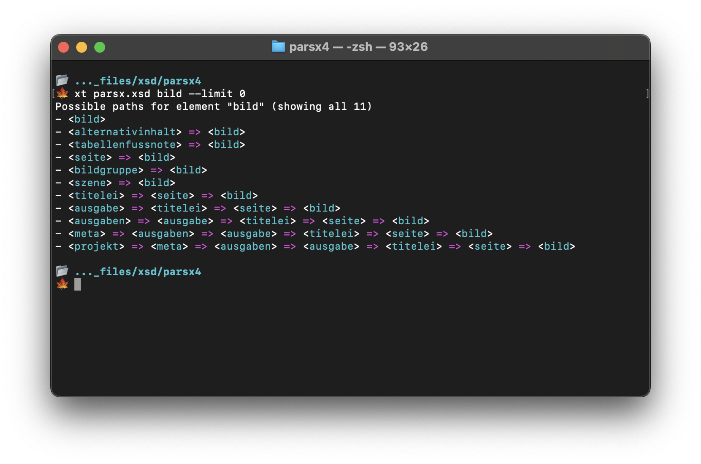

# XML Schema Tools

This is a command line tool that analyzes an XML Schema and finds all element definitions and their relations with each other. This tool's primary function is to find the shortest path from all possible root elements to a given target element.

## Usage



### API

```
xt <file> <element> [flags]
```

### Positional arguments

- **file**: The entry file of the schema
- **element**: The name of the element you want to look for

### Flags

| Flag        | Short | Default | Description                                                                                            |
| ----------- | ----- | ------- | ------------------------------------------------------------------------------------------------------ |
| `--limit`   | `-l`  | 5       | Limit the number of results. Only the shortest results are shown. Use "--limit 0" to show all results. |
| `--exact`   | `-e`  |         | If flag is set and search term is "elem" only "elem" is found. Otherwise "parent/elem" is also found.  |
| `--verbose` | `-v`  |         | Output additional information about the parsed XML Schema.                                             |
